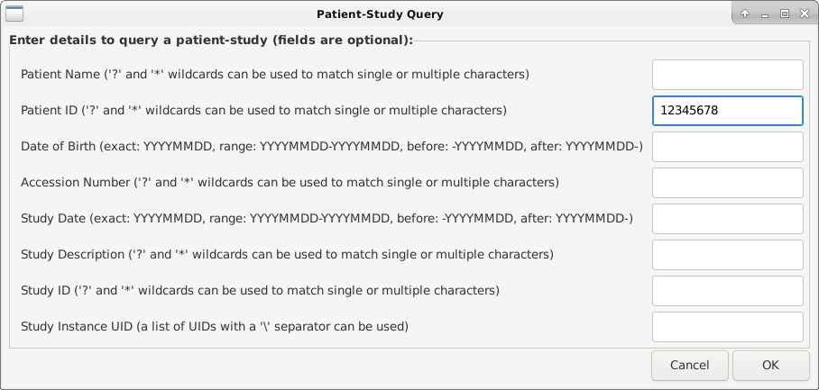
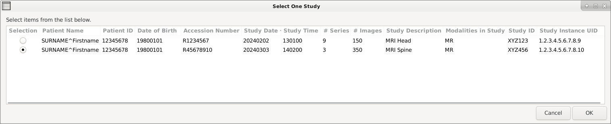
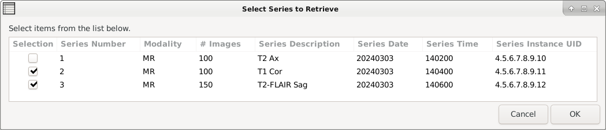

# qrscu

## Synopsis
A bash script to query and retrieve series from studies on a DICOM peer 
using DCMTK tools [echoscu](https://support.dcmtk.org/docs/echoscu.html), 
[findscu](https://support.dcmtk.org/docs/findscu.html), 
[dcmdump](https://support.dcmtk.org/docs/dcmdump.html) and 
[movescu](https://support.dcmtk.org/docs/movescu.html).

## Usage
```bash
qrscu [-h] [--no-color]
```

## Options
- `-h, --help`: print help and exit
- `--no-color`: don't colorize terminal output

## Description
The script does the following:
1. Checks DICOM connectivity with [echoscu](https://support.dcmtk.org/docs/echoscu.html)
>[!NOTE]
> The hostname/ip-address of DICOM peer (`HOST`), tcp/ip port of peer (`PORT`), 
> calling AE title (`AET`) and called AE title (`AEC`) of peer are set using 
> the environment variables `QRSCU_HOST_ENV`, `QRSCU_PORT_ENV`, `QRSCU_AET_ENV`
> and `QRSCU_AEC_ENV` respectively. If these are not set the following defaults 
> are used:
> - `HOST`: `192.168.1.100`
> - `PORT`: `11112`
> - `AET`: `QRSCU`
> - `AEC`: `PACS`

>[!TIP]
> The environment variables can be set in your .bashrc file using export commands:
>  ```bash
> export QRSCU_HOST_ENV="MY_HOSTNAME"
> export QRSCU_PORT_ENV="MY_PORT"
> export QRSCU_AET_ENV="MY_AET"
> export QRSCU_AEC_ENV="MY_AEC"
> ```
> where `MY_HOSTNAME` etc... are the settings you wish to use.

2. Prompts user for patient and study details via a [zenity](https://help.gnome.org/users/zenity/stable/) form:

3. Sends a study-root study-level DICOM query to the peer using [findscu](https://support.dcmtk.org/docs/findscu.html)
4. Prompts to user to select the study of interest using a [zenity](https://help.gnome.org/users/zenity/stable/) radio-list

5. Sends a study-root series-level DICOM query using the Study Instance UID selected above to the peer using [findscu](https://support.dcmtk.org/docs/findscu.html)
6. Prompts to user to select the series to retrieve using a [zenity](https://help.gnome.org/users/zenity/stable/) check-list

7. Retrieves each series using [movescu](https://support.dcmtk.org/docs/movescu.html)

>[!IMPORTANT]
> `qrscu` assumes an external Service Class Provider (SCP) for the Storage 
> Service Class e.g. [storescp](https://support.dcmtk.org/docs/storescp.html) 
> is running with the calling AE title.

## Software Requirements
- [bash](https://www.gnu.org/software/bash/)
- [DCMTK - DICOM Toolkit](https://dicom.offis.de/en/dcmtk/)
- [zenity](https://help.gnome.org/users/zenity/stable/)

## License
See [MIT license](./LICENSE)

## Author
Written by [Stephen Wastling](mailto:stephen.wastling@nhs.net) 

## Acknowledgements
With many thanks to the developers of [bash](https://www.gnu.org/software/bash/),
 the [DCMTK - DICOM Toolkit](https://dicom.offis.de/en/dcmtk/) and 
 [zenity](https://help.gnome.org/users/zenity/stable/).

The script was based on a 
[template](https://betterdev.blog/minimal-safe-bash-script-template/) written 
by Maciej Radzikowski. 

The bash syntax was analysed and checked for bugs using 
[ShellCheck](https://www.shellcheck.net/) written by Vidar Holen.